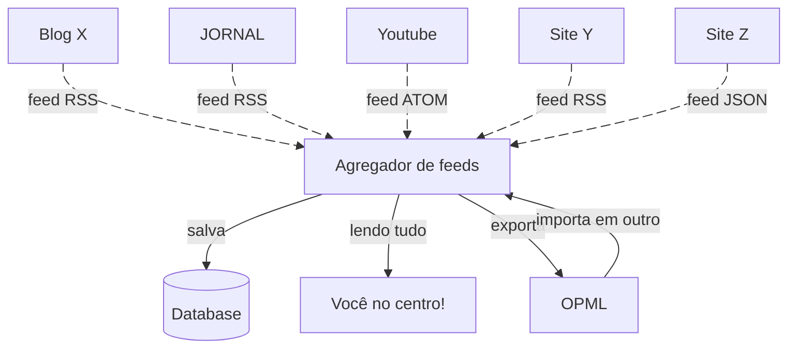

+++
title = "Descentralização de consumo na internet"
date = 2025-04-08T18:56:49-03:00
tag = ["tech", "vida"]
[comments]
host = "bolha.us"
username = "dunossauro"
+++

> Eu tentei ser o menos sarcástico que consegui nessa postagem. Mas, o estado atual da internet me emputesse e eu perco o controle...

Me sinto cada vez mais fatigado da internet, sei que não sou só eu que me sinto assim, então acredito que precisamos conversar…

Grande parte do nosso consumo na rede vem por meio de algorítimos… Você pode até pensar que esse é um papo da "nossa década", mas, na verdade, esse problema é um pouco maior e mais complicado do que isso. O consumo algoritmo está na raiz de tudo que consumimos!

Já se perguntou como você procura por qualquer coisa na internet? Hoje, em 2025, temos três opções:

1. Um oráculo, como um bom "ancião da internet" você sabe usar um buscador. Google...?. Ele faz tracking de toda a sua vida na plataforma e exibe o **"melhor resultado"**, não do que você está procurando, mas o melhor baseado nos trackings que ele fez de você.
2. Em um [cercadinho](https://indieweb.org/silo), como um bom "jovem" você sabe que vai encontrar alguém falando sobre o que você quer saber em qualquer rede social. Claro, ela também fez tracking de tudo que você já consumiu antes e vai te dar uma boa resposta enviesada.
3. Em [papagaio estocástico](https://en.m.wikipedia.org/wiki/Stochastic_parrot), um modelo de linguagem que te entrega os resultados baseados não no seu tracking, mas no viés de todas as pessoas que o treinaram.

Claro, existe uma quarta forma, mas acho que nenhum *boomer* que recebe informações pelo zap está lendo esse texto agora…

Perceba que existe um padrão aqui. Não consumimos a internet descentralizada que nos venderam como a grande "revolução".

Ficou tenso, né? Calma, relaxe assistindo essa série **"Achamos que você vai amar isso"** e quando der play **"antes de assistir, assista esse trailer"**... Ah, você desistiu? Por quê?

Já sei, você cansou, vai ouvir sua playlist **Feito para [nome de usuário].** Quem sabe sua **supermix**. Não é possível…

É melhor ir comer. Toma aqui esse cupom de entrega grátis para os "Famosos no ifood"…

---

**pausa para o anúncio da plataforma**

Oi, meu nome é Betina, tenho 22 anos 1.042.000, de patrimônio acumulado (5 segundos [pular])

---

Deu pra sacar o problema? Vou te ajudar a resolver isso… Link do meu linktree (com tracking + UTM) na bio, cupom de 15% de desconto do meu curso "desfodendo a web" na alura… Corra, por tempo limitado…

> Achou que a propaganda era só da plataforma? E o anunciante que me contratou?


## É preciso descentralizar...

Imagine se houvesse uma forma de me comunicar diretamente com a fonte da informação e saber exatamente quando ela foi atualizada? Sem intermédio, sem sistemas de notificação, sem dependência algorítmica, sem propaganda, sem poluição visual, somente você e o conteúdo...

Espera... Isso me parece uma tecnologia antiga... Meu deus... Isso já existe? Desde 1995? Os Homo erectus da internet já sindicavam conteúdo sem intermédio de redes sociais? Isso não deve ser possível, já evoluímos, tando [dizem...](https://youtu.be/u3CzgfuEskQ?si=Cd2ZW0k2iAxIu1N4)

Como diz meu amigo Pokemao "o futuro da web é o passado". Emburrecemos, não sabemos nos comunicar diretamente com a fonte de informação.


## feeds

Quase todo lugar na internet, pelo menos os que nós queremos estar, disponibiliza um arquivo de resumo com data e hora de publicação. Os chamados feeds. Existem diversos formatos como RSS (Really Simple Syndication), Atom e json feed.

Basicamente, os sites separam um arquivo no próprio site que contém o conteúdo que queremos consumir.

Sei que feeds soam como "consumo de blogs" da década passada, mas basicamente você pode acompanhar tudo que quiser. **Inclusive os blogs**.

Se você, como eu, tem gostos peculiares a respeito de música e gosta de conhecer bandas independentes, o bandcamp mantém um feed específico sobre cenas undergrounds do mundo inteiro:

https://daily.bandcamp.com/

Tudo bem, esse é o link das postagens, mas e o feed?

Basta colocar `/feed` e temos isso:

https://daily.bandcamp.com/feed

O que deve retornar um XML como esse:

```xml
...
    <item>
      <title>The Raw, Rebellious Sound of Chile’s New Rock Underground</title>
      <link>https://daily.bandcamp.com/scene-report/chile-rock-emo-punk-scene-report</link>
      <description><![CDATA[<p><a href="https://daily.bandcamp.com/scene-report/chile-rock-emo-punk-scene-report"></a></p>

<p>A new wave of Chilean rock, emo, punk, and folk bands channel unrest into bracing songs.</p>
<p>Read full story on the <a href="https://daily.bandcamp.com/scene-report/chile-rock-emo-punk-scene-report">Bandcamp Daily</a>.</p>
]]></description>
      <category>Scene Report</category>
      <pubDate>Mon, 07 Apr 2025 17:59:47 -0000</pubDate>
      <guid isPermaLink="false">182365</guid>
      <dc:creator>Richard Villegas, Maria Contreras</dc:creator>
      <dc:date>2025-04-07T17:59:47Z</dc:date>
    </item>
...
```

Sim, esse é o tão amado feed! Tem o título, a cada, a categoria, o link, quem escreveu, etc...


> "Ah… Eduardo… Que papo troncho, quer só pagar de diferentão…" OK, OK…

Jornal? Você lê notícias, não? Todos os jornais que eu conheço tem feeds... Vamos pegar a folha de são Paulo como exemplo

https://www1.folha.uol.com.br/feed/

Você pode seguir qualquer editorial que te agrade!

> "Ah… Seu conformista, lendo mídia burguesa…" OK, o feed da Boi tempo te agrada então?

https://blogdaboitempo.com.br/feed

> "Ah… Eu não interesso por música, notícias me deprimem e eu não sou um comunista safado…"

OK, isentão, você é dev né? Sempre é... Você pode seguir releases dos software/bibliotecas/frameworks. Aqui o exemplo das releases do ruff, pq se você é isentão não se importa com dinheiro de VC fazendo open source:

https://github.com/astral-sh/ruff/releases.atom

Troque o `user/repo` e você terá literalmente o feed de qualquer repositório no github…

---

> "Tá, eu entendi… Mas sou apenas um camponês nesse vasto mundo da internet, consumo coisas normais… Sabe… Tipo YouTube? Um podcast às vezes…"

Vou te contar um segredo, mas não espalha… sabia que feeds podem ser usados pra isso também, né?

https://www.youtube.com/feeds/videos.xml?channel_id=UCAaKeg-BocRqphErdtIUFFw

Esse é o feed (`UCAaKeg-BocRqphErdtIUFFw`) do meu canal no YouTube, troque o id e acompanhe o canal que você gosta…

Pra podcasts também funciona…

https://feeds.simplecast.com/hwQVm5gy

Esse é o feed do naruhodo, meu podcast preferido… O seu podcast com certeza tem um feed também…

Se você estiver procurando por feeds de coisas diferentes, o [OpenRSS](https://openrss.org/feeds) tem algumas opções de cosias diferentes, até mesmo de lives na twitch. Mas, chega de exemplos, CHEGA… Você já entendeu…

## Centralizando a descentralização

Se você não me mandou tomar no cu ainda, sinta-se à vontade. Pode falar "eu tenho cara de quem lê XML com a mente? Ainda mais ficar dando F5 nessa porra o dia todo?"

Calma, floco de neve… Agora você precisa de um leitor de feeds. Um software que vai fazer esse serviço repetitivo de merda de dar F5 a cada delta de tempo e mostrar as novidades. Além de, claro, organizar a bagunça e tornar esse XML legível pra você…

Existem VÁRIOS softwares pra fazer isso. No Android, eu uso o [capy reader](https://capyreader.com/). Software livre e ainda tem uma capivara no logo. Sem mais explicações da escolha…

Depois de cadastrar seus feeds, você pode ter uma visão parecida com essa. Somente o que você quer ver e em ordem cronológica:



É bom ter um leitor de feeds no celular. Aquele momento de paz, que você pararia por 1 minuto, entraria no xwitter pra ler uma merda que vai te deixar igual ao meme da facada mal dada e dar engajamento pra quem só quer [farmar seu rage](https://en.m.wikipedia.org/wiki/Rage-baiting). Você poderia ler alguma coisa que te interesse e não dar audiência pra babaca… Sua terapia agradece…



No PC eu costumo usar o [gfeeds](https://gfeeds.gabmus.org/) com o mesmo feed que eu tenho no celular, afinal… O que não me falta é 1 minuto pra me revoltar nas redes sociais…

O que deve ter uma cara bem parecida com a leitura no celular, mas maior :)



> "Ah… Mas eu uso iPhone… Eu uso windows."

Cada um tem seus defeitos… Não é mesmo… Tenho certeza de que alguém vai te saber recomendar um bom leitor nos comentários desse post.

## OPML

> "Eu vou ter que entrar em link por link no celular e depois de perder 1 semana da minha vida, eu vou ter que fazer isso no PC também? Tá me tirando?"

É aí que entra o [OPML](https://pt.m.wikipedia.org/wiki/OPML) um arquivo que condensa todos os seus feeds em um único `XML`, você pode ajustar as categorias dos feeds, compartilhar com amizades, exportar para backup, importa em outro gerenciador pra testar em outro programa. Assim, você pode testar o que te deixar mais feliz…

As entradas são bastante simples e o arquivo é lido fácilmente:

```xml
<outline text="Balanço e Fúria" title="Balanço e Fúria" description="" type="rss" version="RSS" htmlUrl="" xmlUrl="https://anchor.fm/s/3157c214/podcast/rss"/>
```

Esse é um exemplo de entrada do podcast "Balanço e Fúria" que eu adoro <3


## [E atencão! Se liga ai, que é hora de revisão](https://www.youtube.com/watch?v=lqikvAgyFzE)

Sites mantém uma lista de atualizações, você pode seguir as listas de todos os sites agregar em um gerenciador de feeds e não precisar dos algorítimos pra te mostrar o que você quer ver

<inserir um diagrama aqui>



Você pode compartilhar e salvar suas preferências usando OPML.

Se você quiser um lugar estranho pra começar... Pode usar o meu OPML pessoal... [Aqui](https://codeberg.org/dunossauro/dotfiles/src/branch/main/feed.opml)

> "Ah... Mas eu gosto dos feeds algorítimos"

Entenda... Nem tudo na internet foi escrito pra você...
