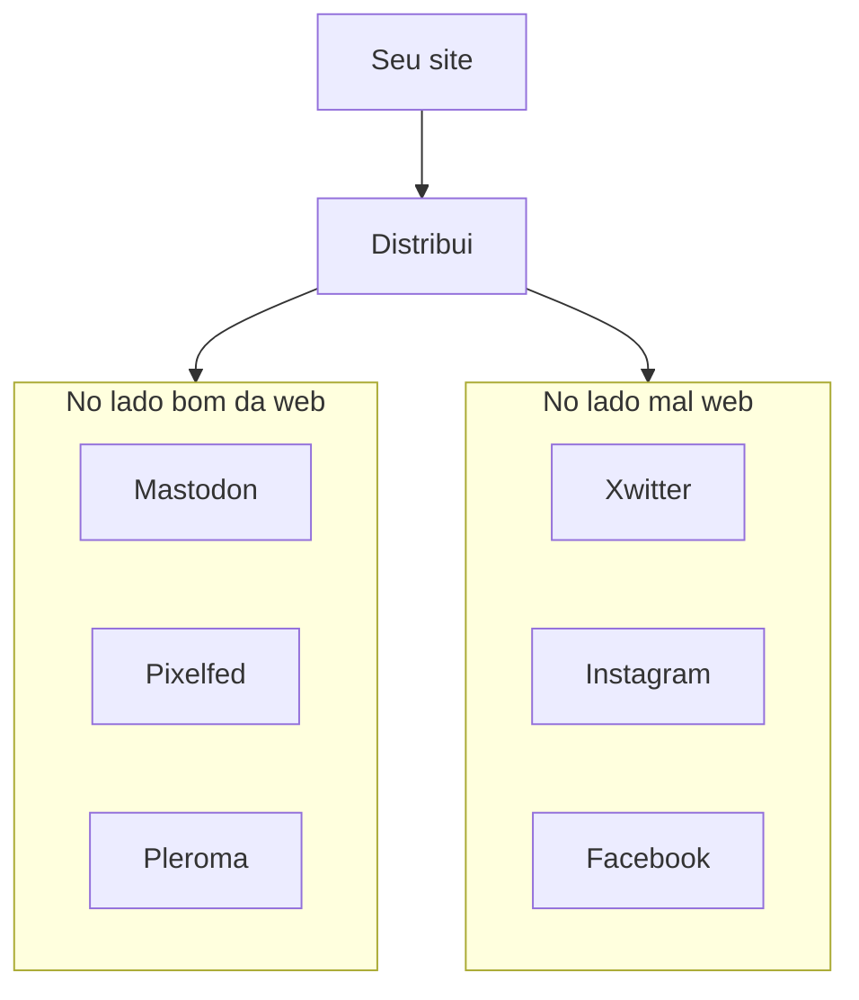

+++
title = "Possua seus dados (e pensamentos também...)"
date = 2025-04-19T00:12:54-03:00
tags = ['posse', 'tech']
[comments]
host = "bolha.us"
username = "dunossauro"
id = 114362452089660112
+++

> Esse post tem diversos diagramas em mermaid que não costumam ser bem lidos pelos leitores de feed, recomento que dê uma olhada na postagem na página.

Um dos grandes problemas de viver nos [silos](https://indieweb.org/silo), pelo menos para mim, é ter de pensar no que vai em cada silo. Como toda pessoa, também sou multifacetado. Penso em coisas diferentes, com formas diferentes, e gosto de falar sobre elas. Mas parece que nem todo silo é adaptado e tem receptividade para comportar tudo que eu penso. Quer exemplos de pensamentos?

- "Já ouviu o último disco do [umnavio](https://umnavio.bandcamp.com/music)?"
- "[Amicu?](https://youtu.be/ZT0sV6PQxdw)"
- "Chapéu de nazista é marreta!"
- "Mano, a pior coisa que eu fiz na vida foi tentar afinar um sintetizador analógico"
- "A inclusão do eglot emacs foi a melhor coisa que o editor já recebeu"
- "[Quer enganar o cliente?](https://youtu.be/dtps_rOjpEE)"
- "Se usa JSON não é REST"
- "Caralho, esse primeiro episódio da 7a temporada de black mirror foi sinistro"
- "Pega todo esse seu código feito por ia e enfia no cu!"
- "Hoje é dia de Live de #Python \o/"
- "Annie Ernaux, por que me machucas?"
- "Apenas escute o Tecnocracia dessa semana!"
- "[Glups moglods](https://www.youtube.com/shorts/v_nlpMn6ZO4), dica da lora"

Pegue qualquer "rede social" e se imagine dizendo todos os tipos de coisas que você pensa...

Os silos, além de me transparecer unidimensionalmente aos outros, fazem com que eu tenha que "me comportar", usando regras de etiqueta do local onde minha publicação pertence. Pra, no final das contas, exercerem o controle de como, via regras algorítmicas, as pessoas vão interagir comigo e claro **lucrarem com o meu conteúdo**.

Ao fim, eu acabo perdendo um pouco de tudo, inclusive a posse dos meus dados.

## Logando a porra toda

Quando me refiro a logs, eu penso em qualquer coisa que eu posto, qualquer forma de compartilhamento de mim para o outro. Como microblog (o que postaríamos no mastodon, bluesky, threads, xwitter),  fotologs (pixelfed, instagram). Até mesmo esse blog que vos fala.

Para quem é mais jovem:

> **Blog** é uma contração de weblog.

Dito isso, o [primeiro princípio](https://indieweb.org/principles#Key_Principles) da [inideweb](https://indieweb.org/Main_Page-pt), a casa de quem está tentando viver [fora dos muros](https://smallweb.page/home) da web corporativa, é ser [dono dos próprios dados](https://indieweb.org/own_your_data).

Construir seu cantinho na internet, seu próprio [jardim digital](https://indieweb.org/digital_garden), é uma boa solução. Você rega aos poucos, planta novas ideias, experimenta novas coisas, **decora com a sua própria estética** e chama as amizades pra frequentar.

Quem sabe até disponibilizar um [feed](/posts/descentralizacao-de-consumo-na-internet), uma forma de dizer a quem te acompanha que você postou algo novo. Sem depender da despersonificação dos silos, você pode compartilhar da forma que quiser e o que quiser, **sem censura**. Afinal, na sua casa, você fala o que quiser!

## Censura

Quando digo censura, você já pode estar imaginando [cyberpunks](https://www.boitempoeditorial.com.br/produto/cypherpunks-152551)[^1] vazando documentos da NSA, [softporn](https://www.wired.com/story/tiktok-nsfw/) em redes sociais, venda de drogas online... Mas não... Não é isso!

[^1]: Leitura recomendadíssima



Eu tô falando de "termos de serviço", principalmente os ambulantes. Aquele que, quando você começa a construir seu castelo nele (no silo do outro), as regras mudam, aí você passa a ser um "fora da lei" do condado eletrônico. E o silo vai te penalizar por isso. É claro... Você não leu o TOS, leu?

Pra te ajudar nisso, porque tudo é TL;DR (to long, don't read) e cheio de [juridiquês](https://pt.wikipedia.org/wiki/Juridiqu%C3%AAs), temos o [TOSDR](https://tosdr.org/) que mostra os pontos mais críticos dos termos.

Mas, basicamente, o que é aceitável hoje... Amanhã pode não ser mais. Tudo aquilo que, foi feito ali pode não existir mais. Existem casos de monte sobre essas coisas e você pode procurar.

Na sua casa, quem faz o TOS é sua ética, as coisas são [feitas pra durar](https://indieweb.org/longevity) (o nono princípio da indieweb).

## POSSE

O grande problema de estar de fora do silo é que embora tudo seja liberado, por mais incrível que você seja no argumento, não vai conseguir ficar de fora dele. Por uma razão incrivelmente simples. Suas amizades vão estar lá, sua família vai estar lá... Isso não quer dizer que você não possa convidar as pessoas a se juntar aos jardins da internet (um dos objetivos dessa postagem). Mas é diminuir a sua dependência do cercadinho pra simplesmente ser "você" e parar de pensar no seu conteúdo para um cercadinho específico. É aí que um conceito importante entra: POSSE.

Como disse o [Guilherme](https://www.gmgall.net/) em [crie a porra de um blog](https://crieaporradeum.blog/#tenha-a-posse-da-porra-toda):

> "POSSE é um acrônimo muito do xexelento em inglês. Significa Post to your Own Site, Syndicate Everywhere, algo como “poste no seu site, distribua em todo canto”."

O segundo S é ponto aqui. Sindique seu conteúdo. Poste no seu jardim e distribua nas redes:

Se suas publicações tiverem links permanentes, você pode simplesmente enviar eles nas redes e falar "Olha aqui...", assim você fica perto das pessoas e mantém seu conteúdo sob o seu domínio. Inclusive, você poderia "reproduzir" o conteúdo e deixar uma referência. Algo como "Postei originalmente aqui [seu link]".

No início, claro, você pode copiar seu link e sair colando por aí, no silo que faça sentido. Sem nenhum problema. Depois, no futuro, quem sabe alguma automação?

~Estou trabalhando nas minhas automações [aqui](https://codeberg.org/dunossauro/sociopyta). Caso você tenha interesse.~

Dessa forma, você se afasta dos silos, dos algorítimos, sem se afastar das pessoas.

## Tá, mas que merda eu faço agora?

Tudo muito legal, tudo bem... Mas tem uma coisa que eu ainda não entendi. Um detalhezinho assim... Qual é o peixe que eu tô tentando vender aqui?

É simples... [CRIE A PORRA DE UM BLOG](https://crieaporradeum.blog), compartilhe suas [notas mentais](https://indieweb.org/note) em uma página com a gente, [possua seus links](https://indieweb.org/own_your_links), dissolva seu conteúdo na internet, compartilhe suas fotos não aesthetic que não dariam likes... Tire suas ideias das mãos dos milionários da tecnologia.

> Ah... Mas ninguém vai ler o que eu posto

Como disse o [Guites](https://guites.bearblog.dev/blog/): [Eu vou ler seu blog](https://guites.dev/eu-vou-ler-seu-blog/). Bota ele aqui nos comentários... Me manda por e-mail. Eu quero ler o que você escreve! Quero conhecer o seu jardim digital, virar um frequentador dele! Conhecer suas facetas -- aquelas coisas que você não vai postar no linkedin pro seu empregador não ler, aquilo que você tem de mais "você" por aí. Aquelas coisas que só desconhecidos da internet sabem sobre você. E, por favor, deixa eu ser um deles.
