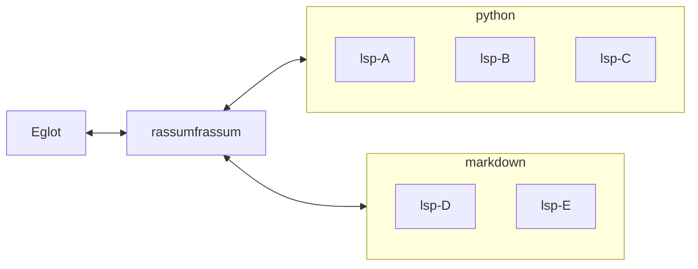

+++
title = "Meu ambiente/setup de programação em 2026"
date = 2026-01-19T19:26:17-03:00
tags = ['tech', 'python', 'gnu/linux']
[comments]
host = "bolha.us"
username = "dunossauro"
id = 115101584307128746
+++




O objetivo desse post (que também é um roteiro de uma live de Python) é contar um pouco sobre o setup que tenho usado atualmente. Tanto para trabalhar quanto para codar no meu tempo livre. A única intenção é mostrar ferramentas que talvez ainda não façam parte do seu dia a dia.

Quero dividir o conteúdo em frentes distintas, para ficar mais fácil de encontrar e enumerar.

Ah... só mais uma coisa... Quando falo em setup, estou falando da parte lógica: sistema, ferramentas, automações e fluxo de trabalho, não de hardware.

## Tópicos

1. Ambiente geral: coisas relacionadas às minhas configurações do ambiente e ferramentas que me auxiliam
2. Ambiente Python: coisas que instalo globalmente com Python e também uso para gerenciar o python
3. Ferramental de projetos: coisas que uso e não necessariamente são dos códigos de produção (linters, task runners, ...)
4. Escolhas para programar: minhas ferramentas de escolha no código, bibliotecas, frameworks, etc.


## 1. Ambiente geral

Bom, não é tão difícil ver que tenho usado GNU/Linux em todos os vídeos desse canal. Atualmente, uso [EndeavourOS](https://endeavouros.com/) variando entre dois ambientes gráficos. [I3WM](https://i3wm.org/) e [Qtile](https://qtile.org/) e meu tema para todas as coisas é o [Catppuccin](https://catppuccin.com/) Mocha.




Bom... vamos às coisas importantes para programar:

| Ferramenta           | Qual?                                            | Pra quê?                                                              |
|----------------------|--------------------------------------------------|-----------------------------------------------------------------------|
| Editor de texto      | [GNU/Emacs](https://www.gnu.org/software/emacs/) | Programar, escrever, organizar a vida e basicamente viver dentro dele |
| Editor de texto (2)  | [Kate](https://kate-editor.org/)                 | Quando, por algum motivo, quero escrever em outro lugar ou no win       |
| Shell                | [GNU/Bash](https://www.gnu.org/software/bash/)   | Shell padrão do sistema e scripts mais portáveis                      |
| Shell (2)            | [Xonsh](https://xon.sh/)                         | Shell interativo usando Python como linguagem principal               |
| Terminal             | [Terminator](https://gnome-terminator.org/)      | Emulador de terminal com splits, profiles e workflows complexos       |
| Ambiente limpo       | [LiMa](https://lima-vm.io/)                      | Criar VMs leves para testar ambientes sem poluir o sistema            |
| Containers           | [Podman](https://podman.io/)                     | Gerenciar containers sem daemon e compatível com Docker               |
| dotfiles             | [dotdrop](https://dotdrop.readthedocs.io/)       | Gerenciar e versionar dotfiles de forma reproduzível                  |
| Provisionamento      | [Ansible](https://docs.ansible.com/)             | Automatizar setup de máquinas e ambientes                             |
| Documentação offline | [Zeal](https://zealdocs.org/)                    | Consultar a documentação sem a necessidade de abrir o browser         |


### Coisas interessantes no editor de texto

É onde acontecem as partes mais importantes do meu fluxo de trabalho. Onde basicamente escrevo código, as aulas, slides e as postagens no blog. Talvez, uma das coisas mais importantes para o nosso contexto, seja um pouco do que uso para programar aqui.

#### Servidores de linguagem

Para me acompanhar durante a escrita de texto e de código, tenho usado alguns [servidores de linguagem](https://en.wikipedia.org/wiki/Language_Server_Protocol). Uma forma de ter autocomplete + correções durante a escrita.

Para gerenciar os servidores de linguagem, uso o [mason-registry](https://mason-registry.dev/) via [mason.el](https://github.com/deirn/mason.el)[^1] e coloco o diretório de downloads dele no PATH para poder usar nos dois editores.

Não tenho conectado diretamente nos servidores, pois em alguns casos gosto de usar mais de um LSP para uma mesma linguagem, o que nem sempre é possível em um mesmo editor. Por isso uso o [rassumfrassum](https://github.com/joaotavora/rassumfrassum).



Ele funciona como um servidor de "proxy", repassando as requisições para os servidores configurados e concatenando as respostas, que são devolvidas de forma síncrona ao editor.

```python
# .config/rassumfrassum/markdown.py
def servers():
    return [
        ['marksman'],
        ['ltex-ls-plus']
    ]
```

Isso me permite tratar LSPs como ferramentas especializadas, em vez de depender de um único servidor “generalista” por linguagem.

Para Python tenho usado:

- [zuban](https://zubanls.com/): faz checagem de tipos, goto, referências e rename
- [ruff](https://docs.astral.sh/ruff/editors/setup/): busca por erros de estilo de código
- [typos](https://github.com/tekumara/typos-lsp): levanta erros gramaticais (inglês) [uso ele em todos os modos de programação]



Para Markdown (o que uso para os slides, blog e textos em geral):

- [marksman](https://github.com/artempyanykh/marksman): cria referências entre arquivos e goto
- [ltex-ls-plus](https://github.com/ltex-plus/ltex-ls-plus): checagem gramatical via languagetool



> Esse assunto por ele mesmo é tão complexo que merecia um blog post só pra ele. Será?

#### Documentação

Geralmente, quando estou programando, abrir o browser, digitar na busca, ir até a página, buscar pelo que quero é trabalhoso. Aqui entra o Zeal em conjunto com meu editor.

`M+x zeal-at-point`, se eu tiver a documentação, ele vai até o ponto e me mostra do que tem lá. O LSP me mostra a docstring, mas às vezes preciso de mais do que isso. Preciso realmente acessar a documentação.



Isso reduz bastante a troca de contexto (context-switching) durante a programação, o que, para mim, faz muita diferença no fluxo. Essas trocas fazem meu foco ir na lua e voltar. hahaha (mesmo ainda estando fora do tema...)

#### Extra: Citações

Outra coisa que me ajuda muito no editor, nessa de ficar mudando de lá pra cá, é o [Citar](https://github.com/emacs-citar/citar), um pacote do Emacs, para citações da minha coleção bibliográfica no [Zotero](https://www.zotero.org/). Quando preciso referenciar algo, com um pequeno comando, insiro a referência lá.

PS: não pense em algo como ABNT ou formatação acadêmica. A ideia aqui é simplesmente não precisar lembrar nomes de papers, subtítulos de livros, PEPs por nome ou número, ou qualquer outro detalhe que quebra o fluxo de escrita.

### Reprodução do ambiente

Umas das coisas que tenho em mente e que faz parte integral do meu ambiente e a "reprodutibilidade" dele. Deixo essas dicas aqui, pois quem está começando pode não ter esse domínio em construir e manter o próprio ambiente.

#### Dotfiles

Dotfiles são arquivos de configuração, que guardam preferências e ajustes das ferramentas que você usa no dia a dia, como terminal, editor de código e Git. Para quem está começando, eles costumam passar despercebidos, mas fazem muita diferença na produtividade e na consistência do ambiente como um todo, não somente de desenvolvimento.

Uma "barra" pesada que a gente enfrenta de tempos em tempos é ter de transferir nossas configurações de um "computador" para outro. Veja que coloquei entre aspas, porque às vezes o computador é o mesmo, mas tivemos que formatar por algum motivo. Ou vamos mudar de pc, ou temos que usar um pc nosso e um do trabalho... São inúmeras possibilidades aqui.

Por exemplo, eu uso [GNU/Bash](https://www.gnu.org/software/bash/) como shell. E ele tem um arquivo base de configuração, o `.bashrc`. Nesse arquivo, posso colocar variáveis de ambiente, alias para comandos, setar algumas configurações, etc. Se eu perder esse arquivo por qualquer motivo que seja, eu vou ter que reconfigurar tudo de novo. Correndo o risco de esquecer algo ou até mesmo não conseguir reproduzir a configuração anterior. Vezes porque procurei uma coisa na internet, "copiei e colei" e nunca mais vou achar o link, ou porque alguém me ajudou com uma configuração e vou ter que aporrinhar essa pessoa de novo.

Uma das técnicas para fugir disso é versionar todos esses arquivos de configuração em um repositório (por exemplo, no Git) para que você possa recriar seu ambiente facilmente em outra máquina, evitar perder configurações importantes e acompanhar mudanças ao longo do tempo.

Um dos problemas de fazer isso é ter que manter os arquivos sempre sincronizados com o repositório. Eu fui futricando na configuração e esqueci de adicionar ao repositório e fazer isso muitas vezes, o tempo todo, é chato. Aí entra uma ferramenta que uso sempre, feita em Python, o [dotdrop](https://dotdrop.readthedocs.io). Com um simples comando como `dotdrop compare` ele me diz se meus arquivos estão diferentes do repositório e com `dotdrop update` ele copia suas configurações atuais para o repositório. Se estiver em outro ambiente, pode rodar um `dotdrop install` e ele vai colocar todos os seus arquivos de configuração do repositório na máquina.

> Caso queira ver meus dotfiles, eles estão aqui: [https://dunossauro.com/dotfiles](https://dunossauro.com/dotfiles).

#### Provisionamento

Além de manter as configurações, claro, precisamos instalar os softwares que usamos nessa nova instalação. É aí que entra o provisionamento.

Provisionamento é o processo de preparar automaticamente um ambiente, instalando pacotes, ferramentas e configurações necessárias para trabalhar ou executar uma aplicação. Para quem está começando, isso ajuda a evitar configurações manuais repetitivas e erros difíceis de reproduzir. Ao versionar esse processo, você registra como o ambiente deve ser montado, possibilitando recriá-lo em outra máquina com poucos comandos.

Tenho usado o [Ansible](https://docs.ansible.com/) para essa função. Escrevemos arquivos declarativos (em yaml) descrevendo todos os softwares que queremos instalar e comandos que queremos executar:

```yaml
---
- name: Exemplo de configuração
  hosts: localhost

  tasks:
    - name: Instalação GNU/Emacs
      become: yes
      package:
        name: emacs
        state: present

    - name: Instalação terminator
      become: yes
      package:
        name: terminator
        state: present

    - name: Cópia dotfiles
      git:
        repo: https://codeberg.org/dunossauro/dotfiles.git
        dest: ~/git/dotfiles

    - name: configura dotfiles
      shell: dotdrop --cfg=~/git/dotfiles/config.yaml install -f
    # ...
```

> Fizemos uma live de ansible no passado [https://ansible.dunossauro.com](https://ansible.dunossauro.com) pode ser que ela te ajude a montar sua configuração.

#### Extra: Ambiente limpo

Uma das coisas que me fazia passar um perrengue antigamente era ter um "ambiente limpo" para testar as coisas. Seja porque eu precisava reproduzir um erro de alguém em um sistema que é diferente do meu. Outra distro linux, outro sistema operacional, outro shell. Ou então, porque eu queria usar algo que claramente mudaria minhas configurações do ambiente. Coisas como trocar o sistema de notificação ou trocar toda uma configuração do meu editor... Coisas desse gênero. Ou ainda, testar como meu código performaria em produção, que **geralmente** tem uma máquina limpa.

Nesse caso, algumas ferramentas me ajudam **muito**:

- [QEMU](https://www.qemu.org/) + [KVM](https://linux-kvm.org/): virtualização completa quando preciso testar sistemas operacionais ou comportamentos mais próximos do hardware real.
- [LiMa](https://lima-vm.io/): máquinas Linux leves e rápidas para testes pontuais de ambiente e reprodução de problemas (usa QEMU como base)
- [Vagrant](https://developer.hashicorp.com/vagrant) + [libvirt](https://libvirt.org/): ambientes completos e reproduzíveis a partir de imagens prontas, úteis para testar outras distros ou sistemas.
- [Podman](https://podman.io/): containers para isolar serviços e dependências durante o desenvolvimento, sem necessidade de uma VM inteira.

Quando uso cada coisa? Se preciso de uma máquina simples, mas completa, geralmente uso o LiMa (que usa como base o QEMU). Se preciso rodar outro sistema, como Windows, costumo baixar essas imagens com Vagrant via libvirt, que baixa uma imagem completa do sistema pronta para ser executada.

Agora, durante o desenvolvimento, se preciso subir um banco de dados, um cache, ou mesmo isolar a minha aplicação, uso containers via podman.

No fim das contas, cada ferramenta resolve um tipo de problema diferente. O importante, para mim, não é escolher "a melhor", mas saber quando usar cada uma.

> Sobre o LiMa, já conversei sobre esse tópico [nesse](https://blog.dunossauro.com/posts/conhecendo-o-lima/) blog post


## 2. Ambiente Python

Bom, como somos a live de Python, nada mais óbvio que programamos Python... Então, vamos ao meu ambiente global de Python. Por global aqui, entenda que o Python é como parte do meu ambiente e ferramentas que uso no sistema, não em projetos.

### Trabalhando com versões diferentes do Python

Um dos pontos principais de usar GNU/Linux e programar Python é entender a máxima primordial do universo **Não, em hipótese alguma, use o Python do sistema**. Existem várias formas de lidar com isso. A forma que prefiro gerenciar é via [Pyenv](https://github.com/pyenv/pyenv).

Embora eu tenha no sistema gerenciadores de projeto que também fazem isso, como Poetry, PDM e UV, pensando no meu sistema, gosto de testar flags de compilação do python em diferentes versões e mantê-las no meu sistema. Por exemplo, uma com o JIT habilitado, outra com o JIT em modo `interpreter`, uma free thread, ... Embora os gerenciadores de projeto possam manipular versões, eles usam pre-compilações e eu gosto de futricar exatamente nesse lugar.


### Ferramentas em Python

Para evitar instalar coisas globalmente, ou no meu shim do pyenv, eu uso o [pipx](https://pipx.pypa.io/). O Pipx é basicamente uma ferramenta para instalar/executar aplicações em python que são disponibilizadas via pypi em um ambiente virtual isolado e que pode ser acessado via PATH. Ele faz esse trabalho sozinho. Além de também ter comandos interessantes como `pipx upgrade-all`. Que atualiza toda a sua base de aplicações.

Algumas coisas que tenho instaladas por lá:

- Gerenciadores de projeto: Poetry, PDM, Hatch, UV, Briefcase ... Cada projeto por onde a gente passa acaba deixando sua marca no sistema
- Ferramentas TUI:
  - [Harlequin](https://harlequin.sh/): um cliente para banco de dados SQL
  - [Posting](https://posting.sh/): um cliente de APIs
  - [toolong](https://github.com/textualize/toolong): uma forma de ler, buscar e organizar arquivos. (uso para ler logs)
- [Foxdot](https://foxdot.org/) e [Sardine](https://sardine.raphaelforment.fr/): porque fazer música com programação é incrível!
- Ferramentas de CLI:
  - [pepotron](https://github.com/hugovk/pepotron): ferramenta que abre as peps pelo número
  - [segno](https://segno.readthedocs.io/): gerador de QR codes
  - [doc2dash](https://doc2dash.hynek.me/): conversor de mkdocs/sphinx para o formato do zeal
  - [httpie](https://httpie.io/): alternativa para curl
  - [rembg](https://github.com/danielgatis/rembg): removedor de fundo de images

Muitas dessas ferramentas eu poderia instalar pelo próprio gerenciador de pacotes da minha distribuição. Mas acho que a proximidade com a linguagem me faz instalar as coisas por aqui. hahaha

## 3. Ferramental de projetos

Agora falamos um pouco sobre meu ambiente em geral. Chegou a hora de falar sobre os projetos em si. Como tenho organizado e criado os ambientes dos meus projetos.

Vale a pena dizer que, talvez, somente talvez, essa gere mais controvérsias por aqui. Como projetos costumam envolver mais pessoas do que somente eu. Umas coisas gosto, outras nem tanto. Mas... vamos lá.

> PS: Muitas dessas configurações em ação podem ser vistas em conjunto no curso de [FastAPI](https://fastapidozero.dunossauro.com/).

### Além do código

Muitas decisões sobre um projeto são tomadas fora do código. Como a escolha do ferramental que vai gerir esse código. Atualmente, uso o [poetry](https://python-poetry.org/) como gerenciador de projeto e de versões do Python nos projetos. E junto da flexibilidade do `pyproject` tenho combinado algumas ferramentas:

- [ruff](https://docs.astral.sh/ruff/): analisador estático de código. Para procurar por "erros", em geral. Também formata o código.
- [taskipy](https://github.com/taskipy/taskipy): um executor de tasks complementar. Para coisas como `task test`, `task lint`
- [poethepoet](https://poethepoet.natn.io/index.html): o mesmo que o `taskipy`, mas uso quando as coisas precisam ser mais bem "azeitadas"
- [zuban](https://zubanls.com/): checador de tipos, uma alternativa ao mypy, mas com mais funcionalidades e mais rápido.
- [darker](https://github.com/akaihola/darker): Ferramenta para formatação de código que aplica as coisas somente aos diffs do git. Ou seja, somente no que alterei, sem formatar lugares que não têm relação nenhuma com o código atual.

Também temos aquelas coisas que fazem parte do projeto, mas não estão alinhadas com o `pyproject`:

- [prek](https://prek.j178.dev/): Uma ferramenta que gerencia hooks de pre-commits no git. Ajuda a validar formatação de arquivos, linhas em branco, ver se não tem um teste quebrando etc.
- [pre-commit](https://pre-commit.com/): A ferramenta na qual o `prek` foi baseada, em alguns projetos ela ainda está lá.
- [invoke](https://www.pyinvoke.org/): Invoke também é um task runner, como o taskipy e o poethepoet, mas ele é programável. Escrevo em python as devs e ele cria automaticamente as tasks em um cli.
- [typos](https://github.com/crate-ci/typos): analisador estático que busca por erros de digitação em inglês.
- [tox](https://tox.wiki/): ferramenta para executar testes (um test runner) que permite executar os testes em N versões do python e de bibliotecas.

Nem todos os projetos usam todas essas ferramentas, inclusive algumas fazem o mesmo ou beiram as responsabilidades de outras. Mas, é o que uso em projetos diversos. Algumas delas são repetidas com o que uso no editor, mas executar no pre-commit ou em CI é muito importante também.

> O editor ajuda enquanto escrevo, o pre-commit quando esqueço xD

### Containers

Para criar e gerir meus containers durante o desenvolvimento, tenho usado [podman](https://podman.io/) e [podman-compose](https://github.com/containers/podman-compose).

Para gerir as dependências dos containers em testes de aplicações, uso o [testcontainers](https://testcontainers.com/)

Por que não docker? Às vezes subo ele no LiMa, mas as licenças do docker e o fato de não ser mais "igual em todos os sistemas", eu tenho evitado.

Outra coisa relacionada a isso é que ando testando as imagens da [chainguard](https://images.chainguard.dev/) nos meus projetinhos de casa e que aprendi recentemente no trabalho[^2] :). São imagens menores, pensadas para produção e com foco em segurança (menos problemas relacionados a [CVEs](https://www.cve.org/)).

## 4. Escolhas para programar

Até aqui, falei bastante de ambiente, ferramentas e processos. Agora chegamos ao ponto onde tudo isso se encontra: o código em si. Aqui estão algumas das escolhas que tenho feito quando estou programando projetos em Python hoje.

**Vale reforçar**: não são escolhas universais, nem definitivas. São ferramentas que têm funcionado bem no meu fluxo atual e que resolvem problemas que aparecem no meu dia a dia.


### Aplicações de terminal

Para CLIs, tenho usado [Cyclopts](https://cyclopts.readthedocs.io/) com [Rich](https://rich.readthedocs.io/). O cyclopts me dá parsing de argumentos simples, bem tipado e com pouco "boilerplate". O Rich entra para melhorar a experiência no terminal. Cores, tabelas, blocos, texto rico, barras de progresso.

Outra coisa que uso menos do que gostaria, mas tenho usado, é o [inquirerpy](https://inquirerpy.readthedocs.io/). Uma biblioteca que fornece inputs dinâmicos. Se a ferramenta vive no terminal, ela precisa ser agradável de usar.

Mais uma coisa que uso menos do que deveria é o [textual](https://textual.textualize.io/), uma biblioteca para construir TUIs. Proporcionando uma experiência completamente diferente, suporte a mouse, imagens, async, ... (pra quem usa ferramentas beeware para GUIs, quase tudo é suportado via Toga).

### Aplicações web

Para aplicações web, tenho gostado bastante de usar o [FastAPI](https://fastapi.tiangolo.com/), principalmente pela simplicidade. Ele me deixa focar no que importa sem brigar com o framework. Apesar disso, confesso que de tempos em tempos acabo namorando o [Quart](https://pgjones.gitlab.io/quart/), o flask-style, vive dentro de mim xD

Para ORM, falem o que falarem, o [SQLAlchemy](https://www.sqlalchemy.org/) continua sendo minha escolha. Como já disse o criador do [Peewee](http://docs.peewee-orm.com/), ele é o *estado da arte* dos ORMs em Python. Não é o mais simples, mas é extremamente flexível e me permite crescer o projeto sem precisar trocar tudo depois.

Quando preciso renderizar **HTML**, costumo usar o [Jinja](https://jinja.palletsprojects.com/). Não é algo que aparece em todo projeto, mas quando aparece, ele resolve bem o problema sem adicionar complexidade desnecessária.

Do outro lado da web, como cliente HTTP, tenho usado o [HTTPX](https://www.python-httpx.org/), principalmente pela API consistente e pelo suporte a async quando faz sentido.

### Testes

Para testes, uso principalmente o [pytest](https://docs.pytest.org/), que combina simplicidade e versatilidade. Gosto especialmente da **parametrização** e dos **markers**, que tornam os testes mais expressivos e fáceis de organizar. Além disso, ele suporta testes escritos com o estilo clássico do `unittest`, facilitando migrar ou integrar código antigo.

Quando preciso de paralelismo ou mocks, adiciono [pytest-xdist](https://pypi.org/project/pytest-xdist/) e [pytest-mock](https://pypi.org/project/pytest-mock/). Para gerar dados falsos e cenários de teste realistas, uso [Faker](https://faker.readthedocs.io/) e [factory_boy](https://factoryboy.readthedocs.io/).

Para **testes baseados em propriedades**, uso [Hypothesis](https://hypothesis.readthedocs.io/), que explora automaticamente combinações de entradas para encontrar casos extremos, e, quando estou testando APIs, uso [Schemathesis](https://schemathesis.readthedocs.io/) em conjunto com ele, garantindo que minhas rotas e esquemas OpenAPI se comportem como esperado. Ambos em conjunto com seus plugins do pytest.

Quando preciso mockar requisições HTTP de forma controlada, recorro ao [respx](https://respx.readthedocs.io/), já que quase sempre uso o HTTPX.

Essa combinação cobre bem desde **testes unitários simples** até **cenários de integração e APIs mais complexas**, mantendo tudo previsível e fácil de manter.


### Outras ferramentas

Algumas ferramentas acabam aparecendo em praticamente todo projeto:

- [loguru](https://loguru.readthedocs.io): para logging com menos atrito inicial
- [ipdb](https://github.com/gotcha/ipdb): para debug interativo quando preciso parar e entender o estado do programa
- [mkdocs](https://www.mkdocs.org/): para documentação
- [towncrier](https://towncrier.readthedocs.io/): para manter changelogs organizados ao longo do tempo

São ferramentas pequenas, mas que ajudam bastante a manter o projeto saudável no médio e longo prazo.


## Pequena conclusão

Ao longo desse post, mostrei meu setup em 2026: desde o sistema operacional, passando por editores, shell, ferramentas globais de Python, até o ferramental que uso nos projetos e minhas escolhas de bibliotecas. Para ser bem sincero, dizer que esse setup é o de “2026” é muito estranho. Por que, provavelmente em algumas semanas, algumas coisas vão acabar mudando por aqui.

Construir um ambiente é uma coisa que leva a vida toda, é praticamente um passatempo. A gente experimenta coisas novas sempre e vai trocando, às vezes volta pra antigas e tá tudo bem.

Meu ponto aqui está longe de ser uma “verdade” como “o que é certo”, não tem FOMO. O objetivo é apresentar como as coisas estão agora, como eu me sinto confortável com meu ambiente e apresentar um monte de coisas que você já poderia conhecer, ou até descobrir coisas novas e testar no seu fluxo de trabalho.

Cada ferramenta tem um propósito: algumas para facilitar a escrita, outras para reduzir context-switching, algumas para garantir consistência e qualidade, e outras só para se divertir um pouco (sim, tocar música com Python é válido).

No fim das contas, o setup ideal é aquele que some do caminho, que deixa você focar no que você quer construir, sem se perder em configurações e ferramentas. Embora isso pareça impossível, com esse tanto de coisas. hahaha

Espero que isso ajude você a pensar com mais carinho em tudo que usa por aí. Um abraço!

Ah… Antes de ir, me conta. O que tem usado por aí?

[^1]: Dica incrível do Krisque
[^2]: Dica do Luiz e do Abreu
